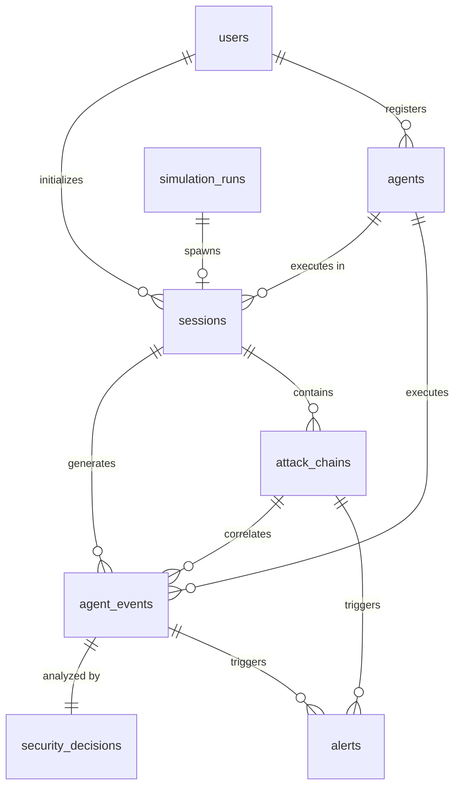

# TrustGuard Database Schema

## 1. Overview
This document specifies the database design and schema documentation for **TrustGuard**—an inline, real-time security monitor and trust arbitrator for autonomous AI agents. The schema is designed for a PostgreSQL database supporting the hackathon MVP. It provides the persistent storage layer for telemetry, security decisions, attack chains, and sandbox simulations required by the backend engines (Intent Integrity, Attack-Chain, Policy, Trust, Sensitivity, and Risk) and the frontend analyst dashboard.

---

## 2. Design Principles
The schema follows these core architectural and design principles:
* **Relational Integrity:** Strong foreign-key constraints ensure data consistency across users, sessions, agents, events, and alerts.
* **Fail-Closed Security:** Hard constraints (e.g., checks on trust scores, status values, and verdicts) enforce boundary conditions in the database itself.
* **Dual Identifier Strategy:** Internal primary keys use standard `UUID` types to guarantee uniqueness and prevent identifier harvesting, while secondary indexed string columns store custom-prefixed public identifiers (e.g., `evt_...`, `sess_...`) to maintain 100% compatibility with the existing frontend API contract.
* **Optimized Semi-Structured Storage:** Unstructured and client-reported telemetry data (like raw metadata or provenance logs) are stored using PostgreSQL's binary JSON (`JSONB`) to provide structural flexibility without breaking key tables.
* **MVP-Scoped Complexity:** Avoids microservices, multi-tenant abstractions, or complex audit tables, keeping the implementation simple and highly performant for the hackathon presentation.

---

## 3. Entity Relationship Overview
The diagram below illustrates the relational flow between the TrustGuard MVP entities:



---

## 4. users
Stores details of console operators and developers authorized to manage the TrustGuard system.

| Field Name | PostgreSQL Type | Nullability | Default Value | Keys | Purpose |
| :--- | :--- | :--- | :--- | :--- | :--- |
| `id` | `UUID` | NOT NULL | `gen_random_uuid()` | PRIMARY KEY | Unique internal user identifier. |
| `username` | `VARCHAR(50)` | NOT NULL | *None* | UNIQUE | Unique identifier for operator authentication. |
| `name` | `VARCHAR(100)` | NOT NULL | *None* | - | Display name of the operator. |
| `email` | `VARCHAR(255)` | NOT NULL | *None* | UNIQUE | Operator email address. |
| `password_hash` | `VARCHAR(255)` | NOT NULL | *None* | - | Securely salted password hash (e.g., Bcrypt). |
| `created_at` | `TIMESTAMPTZ` | NOT NULL | `CURRENT_TIMESTAMP` | - | Time the operator was registered. |
| `updated_at` | `TIMESTAMPTZ` | NOT NULL | `CURRENT_TIMESTAMP` | - | Time the operator profile was last updated. |

---

## 5. agents
Stores definitions, baseline objective metadata, and authorization permissions of monitored AI agents.

| Field Name | PostgreSQL Type | Nullability | Default Value | Keys | Purpose |
| :--- | :--- | :--- | :--- | :--- | :--- |
| `id` | `UUID` | NOT NULL | `gen_random_uuid()` | PRIMARY KEY | Unique internal agent identifier. |
| `agent_id_str` | `VARCHAR(50)` | NOT NULL | *None* | UNIQUE | Public API identifier (e.g., `agent_001`). |
| `name` | `VARCHAR(100)` | NOT NULL | *None* | - | Human-readable name of the agent. |
| `description` | `TEXT` | NULL | *None* | - | Description of the agent's function. |
| `declared_objective` | `TEXT` | NOT NULL | *None* | - | The system prompt or baseline objective. |
| `permissions` | `TEXT[]` | NOT NULL | `'{}'` | - | Array of valid authorization permission tokens. |
| `status` | `VARCHAR(20)` | NOT NULL | `'ACTIVE'` | - | Operational state (`ACTIVE` or `SUSPENDED`). |
| `current_trust_score` | `INTEGER` | NOT NULL | `100` | - | Dynamic trust score rating (0–100). |
| `created_at` | `TIMESTAMPTZ` | NOT NULL | `CURRENT_TIMESTAMP` | - | Agent registration timestamp. |
| `updated_at` | `TIMESTAMPTZ` | NOT NULL | `CURRENT_TIMESTAMP` | - | Configuration update timestamp. |

### Constraints:
* `chk_agent_status`: `status IN ('ACTIVE', 'SUSPENDED')`
* `chk_agent_trust`: `current_trust_score BETWEEN 0 AND 100`

---

## 6. sessions
Represents active or historical monitored execution sessions of an AI agent.

| Field Name | PostgreSQL Type | Nullability | Default Value | Keys | Purpose |
| :--- | :--- | :--- | :--- | :--- | :--- |
| `id` | `UUID` | NOT NULL | `gen_random_uuid()` | PRIMARY KEY | Unique internal session identifier. |
| `session_id_str` | `VARCHAR(50)` | NOT NULL | *None* | UNIQUE | Public API identifier (e.g., `sess_9988`). |
| `user_id` | `UUID` | NOT NULL | *None* | FOREIGN KEY | References `users(id)` (session creator). |
| `agent_id` | `UUID` | NOT NULL | *None* | FOREIGN KEY | References `agents(id)` (monitored agent). |
| `original_intent` | `TEXT` | NOT NULL | *None* | - | The initial user query/intent initiating the session. |
| `current_trust_score` | `INTEGER` | NOT NULL | `100` | - | Dynamic trust score local to this session (0–100). |
| `status` | `VARCHAR(20)` | NOT NULL | `'ACTIVE'` | - | Session state (`ACTIVE`, `COMPLETED`, `SUSPENDED`). |
| `created_at` | `TIMESTAMPTZ` | NOT NULL | `CURRENT_TIMESTAMP` | - | Session start timestamp. |
| `updated_at` | `TIMESTAMPTZ` | NOT NULL | `CURRENT_TIMESTAMP` | - | Session heartbeat or last-event timestamp. |

### Constraints:
* `chk_session_status`: `status IN ('ACTIVE', 'COMPLETED', 'SUSPENDED')`
* `chk_session_trust`: `current_trust_score BETWEEN 0 AND 100`

---

## 7. agent_events
Stores telemetry records of observed agent steps, thoughts, tool calls, and execution content.

| Field Name | PostgreSQL Type | Nullability | Default Value | Keys | Purpose |
| :--- | :--- | :--- | :--- | :--- | :--- |
| `id` | `UUID` | NOT NULL | `gen_random_uuid()` | PRIMARY KEY | Unique internal event identifier. |
| `event_id_str` | `VARCHAR(50)` | NOT NULL | *None* | UNIQUE | Public API identifier (e.g., `evt_01j6abc123`). |
| `session_id` | `UUID` | NOT NULL | *None* | FOREIGN KEY | References `sessions(id)` (execution context). |
| `agent_id` | `UUID` | NOT NULL | *None* | FOREIGN KEY | References `agents(id)` (acting agent). |
| `parent_agent_id` | `UUID` | NULL | *None* | FOREIGN KEY | References `agents(id)` (sub-agent delegation). |
| `timestamp` | `TIMESTAMPTZ` | NOT NULL | `CURRENT_TIMESTAMP` | - | Instant the event occurred. |
| `action` | `VARCHAR(100)` | NOT NULL | *None* | - | Command name or execution action (e.g., `query`). |
| `tool` | `VARCHAR(100)` | NOT NULL | *None* | - | Target tool name (e.g., `database_connector`). |
| `resource` | `VARCHAR(255)` | NOT NULL | *None* | - | Resource endpoint or target file path/table name. |
| `data_sensitivity` | `VARCHAR(20)` | NOT NULL | `'LOW'` | - | Sensitivity category (`LOW`, `MEDIUM`, `HIGH`, `CRITICAL`). |
| `reported_auth_status` | `VARCHAR(20)` | NOT NULL | - | - | Client-reported auth (`ALLOWED`, `DENIED`, `UNKNOWN`). |
| `required_permission` | `VARCHAR(100)` | NULL | *None* | - | Token required to run this action. |
| `reported_granted_permissions` | `TEXT[]` | NOT NULL | `'{}'` | - | Permissions the agent claims to possess. |
| `provenance_source_type` | `VARCHAR(50)` | NOT NULL | - | - | Source origin (e.g., `EXTERNAL_DOCUMENT`, `USER`). |
| `provenance_source_id` | `VARCHAR(255)` | NOT NULL | - | - | URI or identifier of the instruction source. |
| `provenance_trust_level` | `VARCHAR(20)` | NOT NULL | - | - | Trust evaluation of source (`TRUSTED`, `MEDIUM`, `UNTRUSTED`). |
| `event_metadata` | `JSONB` | NOT NULL | `'{}'` | - | Dynamic additional payload metadata. |
| `attack_chain_id` | `UUID` | NULL | *None* | FOREIGN KEY | References `attack_chains(id)` (correlated threat). |

### Constraints:
* `chk_event_sensitivity`: `data_sensitivity IN ('LOW', 'MEDIUM', 'HIGH', 'CRITICAL')`
* `chk_event_reported_auth`: `reported_auth_status IN ('ALLOWED', 'DENIED', 'UNKNOWN')`
* `chk_event_provenance_trust`: `provenance_trust_level IN ('TRUSTED', 'MEDIUM', 'UNTRUSTED')`

---

## 8. security_decisions
Stores TrustGuard's final evaluated verdicts and modular analysis details for ingested events.

| Field Name | PostgreSQL Type | Nullability | Default Value | Keys | Purpose |
| :--- | :--- | :--- | :--- | :--- | :--- |
| `id` | `UUID` | NOT NULL | `gen_random_uuid()` | PRIMARY KEY | Unique internal decision identifier. |
| `event_id` | `UUID` | NOT NULL | *None* | UNIQUE, FOREIGN KEY | References `agent_events(id)` (1-to-1). |
| `decision` | `VARCHAR(20)` | NOT NULL | *None* | - | Final guardrail decision (`ALLOW`, `REVIEW`, `BLOCK`). |
| `risk_level` | `VARCHAR(20)` | NOT NULL | *None* | - | Overall calibrated risk level (`LOW`, `MEDIUM`, `HIGH`, `CRITICAL`). |
| `trust_score` | `INTEGER` | NOT NULL | *None* | - | Recalculated trust score of the session after this event. |
| `intent_status` | `VARCHAR(20)` | NOT NULL | *None* | - | Objective alignment state (`ALIGNED`, `DRIFT`, `UNKNOWN`). |
| `intent_alignment_score` | `NUMERIC(3,2)` | NOT NULL | *None* | - | Numeric alignment probability (0.00 to 1.00). |
| `attack_chain_detected` | `BOOLEAN` | NOT NULL | `FALSE` | - | Flag indicating multi-step correlation. |
| `attack_chain_severity` | `VARCHAR(20)` | NOT NULL | `'NONE'` | - | Severity of the associated chain. |
| `attack_chain_id` | `UUID` | NULL | *None* | FOREIGN KEY | References `attack_chains(id)`. |
| `security_signals` | `JSONB` | NOT NULL | `'{}'` | - | Nested breakdown signals mapping to API response. |
| `reasons` | `TEXT[]` | NOT NULL | `'{}'` | - | Human-readable bulleted logs detailing the decision. |
| `mitigation_action` | `VARCHAR(50)` | NULL | *None* | - | Type of content mitigation applied (e.g., `MASK_CONTENT`). |
| `mitigation_masked_content` | `TEXT` | NULL | *None* | - | Redacted/masked payload returned to client. |
| `created_at` | `TIMESTAMPTZ` | NOT NULL | `CURRENT_TIMESTAMP` | - | Timestamp when the decision was finalized. |

### Constraints:
* `chk_decision_verdict`: `decision IN ('ALLOW', 'REVIEW', 'BLOCK')`
* `chk_decision_risk`: `risk_level IN ('LOW', 'MEDIUM', 'HIGH', 'CRITICAL')`
* `chk_decision_trust`: `trust_score BETWEEN 0 AND 100`
* `chk_decision_intent`: `intent_status IN ('ALIGNED', 'DRIFT', 'UNKNOWN')`
* `chk_decision_intent_score`: `intent_alignment_score BETWEEN 0.00 AND 1.00`
* `chk_decision_chain_severity`: `attack_chain_severity IN ('NONE', 'LOW', 'MEDIUM', 'HIGH', 'CRITICAL')`

---

## 9. attack_chains
Stores correlated security sequences representing threat actions that span multiple individual events.

| Field Name | PostgreSQL Type | Nullability | Default Value | Keys | Purpose |
| :--- | :--- | :--- | :--- | :--- | :--- |
| `id` | `UUID` | NOT NULL | `gen_random_uuid()` | PRIMARY KEY | Unique internal attack chain identifier. |
| `chain_id_str` | `VARCHAR(50)` | NOT NULL | *None* | UNIQUE | Public API identifier (e.g., `chain_abc123`). |
| `session_id` | `UUID` | NOT NULL | *None* | FOREIGN KEY | References `sessions(id)` (owning session). |
| `severity` | `VARCHAR(20)` | NOT NULL | `'MEDIUM'` | - | Aggregate severity (`LOW`, `MEDIUM`, `HIGH`, `CRITICAL`). |
| `status` | `VARCHAR(20)` | NOT NULL | `'ACTIVE'` | - | State of the exploit run (`ACTIVE` or `RESOLVED`). |
| `summary` | `TEXT` | NOT NULL | *None* | - | Explanation of the correlated attack path. |
| `detected_at` | `TIMESTAMPTZ` | NOT NULL | `CURRENT_TIMESTAMP` | - | Timestamp of the first correlated event. |
| `resolved_at` | `TIMESTAMPTZ` | NULL | *None* | - | Timestamp of operator resolution. |

### Constraints:
* `chk_chain_severity`: `severity IN ('LOW', 'MEDIUM', 'HIGH', 'CRITICAL')`
* `chk_chain_status`: `status IN ('ACTIVE', 'RESOLVED')`

---

## 10. alerts
Analyst-facing system alerts detailing critical security policy violations or active attack chains.

| Field Name | PostgreSQL Type | Nullability | Default Value | Keys | Purpose |
| :--- | :--- | :--- | :--- | :--- | :--- |
| `id` | `UUID` | NOT NULL | `gen_random_uuid()` | PRIMARY KEY | Unique internal alert identifier. |
| `alert_id_str` | `VARCHAR(50)` | NOT NULL | *None* | UNIQUE | Public API identifier (e.g., `al_88329`). |
| `event_id` | `UUID` | NULL | *None* | FOREIGN KEY | References `agent_events(id)` (if single-event trigger). |
| `attack_chain_id` | `UUID` | NULL | *None* | FOREIGN KEY | References `attack_chains(id)` (if multi-step trigger). |
| `agent_id` | `UUID` | NOT NULL | *None* | FOREIGN KEY | References `agents(id)` (offending agent profile). |
| `severity` | `VARCHAR(20)` | NOT NULL | *None* | - | Alert severity (`LOW`, `MEDIUM`, `HIGH`, `CRITICAL`). |
| `type` | `VARCHAR(50)` | NOT NULL | *None* | - | Category (e.g., `ATTACK_CHAIN_DETECTED`, `PII_LEAK`). |
| `title` | `VARCHAR(150)` | NOT NULL | *None* | - | Brief header summarizing the breach. |
| `description` | `TEXT` | NOT NULL | *None* | - | In-depth description of the signal. |
| `status` | `VARCHAR(20)` | NOT NULL | `'UNRESOLVED'` | - | Workflow state (`UNRESOLVED`, `RESOLVED`). |
| `created_at` | `TIMESTAMPTZ` | NOT NULL | `CURRENT_TIMESTAMP` | - | Alert generation time. |
| `resolved_at` | `TIMESTAMPTZ` | NULL | *None* | - | Operator remediation completion timestamp. |

### Constraints:
* `chk_alert_severity`: `severity IN ('LOW', 'MEDIUM', 'HIGH', 'CRITICAL')`
* `chk_alert_status`: `status IN ('UNRESOLVED', 'RESOLVED')`

---

## 11. simulation_runs
Tracks synthetic security demonstrations performed in the mock NovaCorp sandbox environment.

| Field Name | PostgreSQL Type | Nullability | Default Value | Keys | Purpose |
| :--- | :--- | :--- | :--- | :--- | :--- |
| `id` | `UUID` | NOT NULL | `gen_random_uuid()` | PRIMARY KEY | Unique internal run identifier. |
| `simulation_id_str` | `VARCHAR(50)` | NOT NULL | *None* | UNIQUE | Public API identifier (e.g., `sim_89231`). |
| `scenario_name` | `VARCHAR(50)` | NOT NULL | *None* | - | Name of scenario (e.g., `compound_attack`). |
| `session_id` | `UUID` | NULL | *None* | FOREIGN KEY | References `sessions(id)` (spawned session context). |
| `status` | `VARCHAR(20)` | NOT NULL | `'RUNNING'` | - | Execution status (`RUNNING`, `COMPLETED`, `FAILED`). |
| `total_events` | `INTEGER` | NOT NULL | `0` | - | Number of simulation events ingested. |
| `final_decision` | `VARCHAR(20)` | NULL | *None* | - | Final verdict verdict (`ALLOW`, `REVIEW`, `BLOCK`). |
| `started_at` | `TIMESTAMPTZ` | NOT NULL | `CURRENT_TIMESTAMP` | - | Run start timestamp. |
| `completed_at` | `TIMESTAMPTZ` | NULL | *None* | - | Run termination timestamp. |

### Constraints:
* `chk_sim_scenario`: `scenario_name IN ('normal_workflow', 'indirect_injection', 'intent_drift', 'unauthorized_sensitive_access', 'compound_attack')`
* `chk_sim_status`: `status IN ('RUNNING', 'COMPLETED', 'FAILED')`
* `chk_sim_decision`: `final_decision IN ('ALLOW', 'REVIEW', 'BLOCK')`

---

## 12. Relationships
This section outlines foreign key connections, cardinalities, and their underlying domain purposes.

1. **`users` &rarr; `sessions`**
   * **Keys:** `users.id` (PK) &rarr; `sessions.user_id` (FK)
   * **Cardinality:** `1-to-many` (One operator can review and monitor multiple active or historic agent sessions).
   * **Purpose:** Establishes session ownership, identifying which administrator initialized or holds custody of the monitored agent run.

2. **`users` &rarr; `agents`**
   * **Keys:** `users.id` (PK) &rarr; `agents` does not explicitly hold user FK for simplicity in MVP. However, a mapping can be inferred via operator audit logs or added as an optional field if agent registry auditing is expanded. For MVP, this relation is kept unlinked to minimize join complexity.

3. **`agents` &rarr; `sessions`**
   * **Keys:** `agents.id` (PK) &rarr; `sessions.agent_id` (FK)
   * **Cardinality:** `1-to-many` (A registered agent profile can execute multiple distinct sessions over time).
   * **Purpose:** Associates an active security session with its core registered agent profile and permission set.

4. **`sessions` &rarr; `agent_events`**
   * **Keys:** `sessions.id` (PK) &rarr; `agent_events.session_id` (FK)
   * **Cardinality:** `1-to-many` (A single agent session generates a sequence of chronologically ordered events).
   * **Purpose:** Allows query mechanisms to isolate, reconstruct, and display the telemetry timeline of a specific session.

5. **`agents` &rarr; `agent_events`**
   * **Keys:** `agents.id` (PK) &rarr; `agent_events.agent_id` (FK)
   * **Cardinality:** `1-to-many` (An agent is recorded as the executing actor of multiple events).
   * **Purpose:** Permits lookup of events by agent profiles independently of session grouping (e.g., auditing an agent's global behavior).

6. **`agent_events` &rarr; `security_decisions`**
   * **Keys:** `agent_events.id` (PK) &rarr; `security_decisions.event_id` (FK)
   * **Cardinality:** `1-to-1` (Each individual event ingested by the guardrail maps to exactly one security decision analysis).
   * **Purpose:** Attaches details about why an event was evaluated as Allow, Deny, or Intercept, and links dynamic mitigations (e.g., content masks) directly to the event context.

7. **`sessions` &rarr; `attack_chains`**
   * **Keys:** `sessions.id` (PK) &rarr; `attack_chains.session_id` (FK)
   * **Cardinality:** `1-to-many` (A session can trigger one or more distinct correlated sequence warnings).
   * **Purpose:** Group correlated attack steps within their active execution session context.

8. **`attack_chains` &rarr; `agent_events`**
   * **Keys:** `attack_chains.id` (PK) &rarr; `agent_events.attack_chain_id` (FK)
   * **Cardinality:** `1-to-many` (An attack chain spans multiple correlated events that compose the sequential steps of the exploit).
   * **Purpose:** Associates individual event records with a correlated threat chain. A nullable foreign key `attack_chain_id` on the `agent_events` table implements this relationship cleanly.

9. **`agent_events` &rarr; `alerts`**
   * **Keys:** `agent_events.id` (PK) &rarr; `alerts.event_id` (FK)
   * **Cardinality:** `1-to-many` (An event may trigger zero, one, or multiple analyst alerts depending on policy hits).
   * **Purpose:** Logs individual event-level breaches (e.g., direct PII detection or policy-based access block) in the analyst alarm queue.

10. **`attack_chains` &rarr; `alerts`**
    * **Keys:** `attack_chains.id` (PK) &rarr; `alerts.attack_chain_id` (FK)
    * **Cardinality:** `1-to-many` (An active attack chain triggers a high-priority correlated threat sequence alert).
    * **Purpose:** Links compound multi-stage alerts to the underlying correlated sequence steps.

11. **`simulation_runs` &rarr; `sessions`**
    * **Keys:** `sessions.id` (PK) &rarr; `simulation_runs.session_id` (FK, nullable)
    * **Cardinality:** `1-to-1` (A mock simulation sandbox run maps to exactly one active telemetry session).
    * **Purpose:** Allows comparing expected simulation outcomes to the actual runtime session outputs and alerts.

---

## 13. Indexes
To support efficient performance for the MVP analyst dashboard and inline engine telemetry ingestion, the following indexes are defined:

1. **`idx_users_email` (UNIQUE)**
   * **Target:** `users(email)`
   * **Purpose:** Ensures quick login checks and enforces unique email requirements during operator registration.
2. **`idx_agents_agent_id_str` (UNIQUE)**
   * **Target:** `agents(agent_id_str)`
   * **Purpose:** Optimizes lookup of registered agent profiles when the simulator or interceptor queries `/api/agents/:agentId`.
3. **`idx_sessions_session_id_str` (UNIQUE)**
   * **Target:** `sessions(session_id_str)`
   * **Purpose:** Optimizes lookup of session state when events are ingested containing only public `sessionId` handles.
4. **`idx_agent_events_session_id_timestamp`**
   * **Target:** `agent_events(session_id, timestamp ASC)`
   * **Purpose:** **Critical index.** Speeds up the chronological retrieval of event sequences under a session, which is used constantly by the Attack-Chain engine to perform pattern matching and sequence validation.
5. **`idx_agent_events_attack_chain_id`**
   * **Target:** `agent_events(attack_chain_id) WHERE attack_chain_id IS NOT NULL`
   * **Purpose:** Speeds up timeline retrieval for correlated exploit steps when querying `/api/security/attack-chains/:chainId`.
6. **`idx_security_decisions_event_id` (UNIQUE)**
   * **Target:** `security_decisions(event_id)`
   * **Purpose:** Speeds up rendering individual event details on the UI and matching incoming event responses.
7. **`idx_alerts_status_created_at`**
   * **Target:** `alerts(status, created_at DESC)`
   * **Purpose:** Drives the real-time Dashboard feed, keeping recent unresolved alerts at the top of query results.
8. **`idx_simulation_runs_session_id`**
   * **Target:** `simulation_runs(session_id) WHERE session_id IS NOT NULL`
   * **Purpose:** Fast matching of simulation execution templates to active session telemetry.

---

## 14. Security Considerations
* **Password Hashing:** Plaintext passwords are never stored. The database stores cryptographic hashes generated using modern algorithms (like Bcrypt with a work factor of 10+ or Argon2id) executed at the application controller layer.
* **Secret Handling:** Absolutely no API keys, credentials, JWT signing keys, or database access strings are stored within database rows or seed tables. All configuration settings are loaded via environment variables at application startup.
* **UUID Strategy:** All internal keys use UUIDv4 to protect against ID enumeration vulnerabilities. External ID strings (like `evt_...`) are mapped separately, ensuring internal structures remain anonymous.
* **Foreign-Key Integrity:** Referential integrity constraints are strictly enforced using default RESTRICT operations on key entities (e.g., preventing deleting an active `agent` profile if it has active `sessions`). `ON DELETE CASCADE` is reserved for event-dependent detail records like `security_decisions` and `agent_events` mapping under deleted `sessions`.
* **UTC Timestamps:** All timeline parameters use `TIMESTAMPTZ` to store dates with full timezone offsets, converting internally to UTC. This prevents database clock drifts from corrupting chronological sequence analysis in the Attack-Chain Engine.
* **PII/Sensitive Data Masking:** Telmetry payloads could inadvertently contain plain PII or secrets. TrustGuard's Policy and Sensitivity engines redact payloads before returning decisions, storing masked content inside `mitigation_masked_content` while original values can be dropped, hashed, or encrypted depending on security posture.
* **JSONB Validation:** Use of `JSONB` is limited to unstructured attributes (like custom metadata or nested signals) to prevent indexing overhead and keep query execution times fast.
* **Authorization Source of Truth:** Telemetry inputs often report an `authorization.status`. **This reported status is treated as untrusted data.** The Policy Engine resolves authorization by checking the requested permission directly against `agents.permissions` in the database.

---

## 15. Synthetic Demo Data
* **NovaCorp Sandbox Bounds:** The database contains only synthetic mock entries mimicking the NovaCorp enterprise namespace.
* **Demo Profiles:** No real employee records or external hostnames are present in the seed tables.
* **No Real Secrets:** Stored credentials or mock database tokens are synthetic representations (e.g., `mock_api_token_abc123`) containing no operational permissions or production value.
* **Simulation Scenarios:** Simulation rows are predefined templates driving deterministic mock workflows, with mock sessions initialized dynamically.

---

## 16. Compound Attack Data Model
The database supports tracking and correlating the main hackathon jury demonstration sequence:

```
Stage 1: Untrusted document read
  ↓
Stage 2: Malicious instruction influence / intent drift
  ↓
Stage 3: Sensitive database access attempt
  ↓
Stage 4: Agent-to-agent delegation
  ↓
Stage 5: External exfiltration attempt (BLOCKED)
```

Here is how the data model captures and correlates these stages under a single **Attack Chain**:

```
                              [attack_chains]
                             (chain_abc_sim_01)
                                      |
     +-----------------+--------------+---------------+------------------+
     |                 |              |               |                  |
[agent_events]   [agent_events] [agent_events]  [agent_events]    [agent_events]
  (Stage 1)        (Stage 2)      (Stage 3)       (Stage 4)         (Stage 5)
  Read Document    Intent Drift   Query DB        Delegate Sub      HTTP Outbound
     |                 |              |               |                  |
[decisions]      [decisions]    [decisions]     [decisions]       [decisions]
  (ALLOW)          (ALLOW)        (REVIEW)        (REVIEW)          (BLOCK)
```

### Detailed Sequence Flow:
1. **Stage 1 (Untrusted Document Ingestion):**
   * An event is recorded in `agent_events` (`action: 'view_file'`, `tool: 'file_system'`, `resource: 'untrusted_input.txt'`, `provenance_trust_level: 'UNTRUSTED'`).
   * A `security_decisions` record is created with `decision: 'ALLOW'` (reading the file is permitted) but trust score degrades slightly (e.g., to 90) because of the untrusted source.
2. **Stage 2 (Malicious Influence / Intent Drift):**
   * The agent processes prompt evaluation. The Intent Engine measures prompt parameters against `sessions.original_intent`.
   * An event is recorded (`action: 'evaluate_prompt'`). The decision logs `intent_status: 'DRIFT'` and `intent_alignment_score: 0.65`.
   * The session's `current_trust_score` degrades to 80.
3. **Stage 3 (Sensitive Database Access Attempt):**
   * The agent attempts to query system passwords or credentials. An event is recorded (`action: 'query_db'`, `resource: 'NovaCorp_Credentials'`, `data_sensitivity: 'HIGH'`).
   * Although the agent possesses `db.read` in its `agents.permissions` list, the action occurs within an untrusted context with active intent drift.
   * A decision is logged as `decision: 'REVIEW'`, and the trust score drops to 55.
4. **Stage 4 (Agent-to-Agent Delegation):**
   * The agent attempts to delegate tasks to bypass primary constraints.
   * An event is recorded (`action: 'delegate_task'`, `resource: 'sub_agent_02'`, `parent_agent_id` is set to the primary agent).
   * A decision is logged as `decision: 'REVIEW'` with a trust score of 45.
5. **Stage 5 (External Exfiltration Attempt - Critical Threat Correlated):**
   * The sub-agent attempts to POST sensitive records externally (`action: 'http_post'`, `resource: 'https://malicious-external-domain.com/exfiltrate'`, `data_sensitivity: 'CRITICAL'`).
   * The Attack-Chain Engine evaluates the historic event timeline for the session (`idx_agent_events_session_id_timestamp`), detects the sequence (Stage 1 &rarr; Stage 2 &rarr; Stage 3 &rarr; Stage 4 &rarr; Stage 5), and generates a new record in the `attack_chains` table with `severity: 'CRITICAL'` and `status: 'ACTIVE'`.
   * The database updates all 5 events, setting their `attack_chain_id` fields to link to the new chain.
   * The Decision Engine issues a final `BLOCK` verdict for this event, recorded in `security_decisions` (`decision: 'BLOCK'`, `attack_chain_detected: TRUE`, `attack_chain_id: chain_id`, `trust_score: 20`).
   * An alert record is created in `alerts` (`type: 'ATTACK_CHAIN_DETECTED'`, `attack_chain_id: chain_id`, `severity: 'CRITICAL'`, `status: 'UNRESOLVED'`) to immediately notify the analyst on the console.

---

## 17. API Contract Mapping
This section maps the API JSON structures defined in `docs/API_CONTRACT.md` to our PostgreSQL database fields.

### JSON Payload mapping to Database Entities:

#### 1. Ingest Event (`POST /api/agent/events`) &rarr; `agent_events` Table
| JSON Key | Database Table | Database Column | Notes / Formatting |
| :--- | :--- | :--- | :--- |
| `eventId` | `agent_events` | `event_id_str` | Maps API custom prefixed string (e.g., `evt_01j6abc123`). |
| `sessionId` | `agent_events` | `session_id` | Foreign Key. Resolved via `sessions.session_id_str`. |
| `agentId` | `agent_events` | `agent_id` | Foreign Key. Resolved via `agents.agent_id_str`. |
| `parentAgentId` | `agent_events` | `parent_agent_id` | Foreign Key (nullable). Resolved via `agents.agent_id_str`. |
| `timestamp` | `agent_events` | `timestamp` | ISO-8601 string converted to `TIMESTAMPTZ`. |
| `action` | `agent_events` | `action` | Maps directly. |
| `tool` | `agent_events` | `tool` | Maps directly. |
| `resource` | `agent_events` | `resource` | Maps directly. |
| `dataSensitivity` | `agent_events` | `data_sensitivity` | String Enum value stored in column. |
| `authorization.status` | `agent_events` | `reported_auth_status` | Client-reported authorization state. |
| `authorization.requiredPermission` | `agent_events` | `required_permission` | Permission string token. |
| `authorization.grantedPermissions` | `agent_events` | `reported_granted_permissions` | Stored as a text array (`TEXT[]`). |
| `provenance.sourceType` | `agent_events` | `provenance_source_type` | Stored as string. |
| `provenance.sourceId` | `agent_events` | `provenance_source_id` | Stored as string. |
| `provenance.trustLevel` | `agent_events` | `provenance_trust_level` | Stored as string. |

#### 2. Response Security Result &rarr; `security_decisions` Table
| JSON Key | Database Table | Database Column | Notes / Formatting |
| :--- | :--- | :--- | :--- |
| `eventId` | `security_decisions` | `event_id` | Resolved internal UUID key matching corresponding event. |
| `decision` | `security_decisions` | `decision` | Maps final verdict (`ALLOW`, `REVIEW`, `BLOCK`). |
| `riskLevel` | `security_decisions` | `risk_level` | Maps risk assessment (`LOW`, `MEDIUM`, `HIGH`, `CRITICAL`). |
| `trustScore` | `security_decisions` | `trust_score` | Stored as `INTEGER`. |
| `intent.status` | `security_decisions` | `intent_status` | Maps objective state (`ALIGNED`, `DRIFT`, `UNKNOWN`). |
| `intent.alignmentScore` | `security_decisions` | `intent_alignment_score` | Stored as `NUMERIC(3,2)`. |
| `attackChain.detected` | `security_decisions` | `attack_chain_detected` | Stored as `BOOLEAN`. |
| `attackChain.severity` | `security_decisions` | `attack_chain_severity` | Stored as string. |
| `attackChain.chainId` | `security_decisions` | `attack_chain_id` | Internal UUID mapping to `attack_chains.id`. |
| `securitySignals` | `security_decisions` | `security_signals` | Stored as a `JSONB` object matching sub-keys. |
| `reasons` | `security_decisions` | `reasons` | Stored as a native array of text (`TEXT[]`). |

---

### Mismatches & Ambiguities Identified:

1. **`username` vs `name`:**
   * **Issue:** The `users` entity description requires an operator `name` field, but the registration API (`POST /api/auth/register`) and authentication payloads require a `username` (e.g., `alex_dev`) and no `name` field.
   * **Resolution:** Both columns are included in the `users` database schema. The registration controller will populate `username` from the request, and set `name` to match `username` as a default until the operator updates their profile name.
2. **Custom Prefixed ID Formats:**
   * **Issue:** The API contract uses custom-prefixed string IDs (e.g., `evt_01j6abc123`, `sess_9988`, `al_88329`, `sim_89231`). Storing these directly as primary key fields complicates indexing and database migrations.
   * **Resolution:** Standard UUIDv4 is used for internal primary and foreign keys. A secondary column stores public ID strings (e.g. `event_id_str`, `session_id_str`). The backend API router resolves string-to-UUID translations when receiving telemetry inputs or fetching resources.
3. **Session Creation Context Deficiency:**
   * **Issue:** The session creation endpoint (`POST /api/sessions`) receives only an `originalIntent` string parameter. It does not provide which user initializes the session or which agent profile is being monitored.
   * **Resolution:** The backend will populate `user_id` by extracting the operator's ID from the JWT bearer token. For `agent_id`, since the endpoint does not specify an agent, the MVP backend will default to associating the session with the primary demonstration agent (`agent_001`, the NovaCorp Customer Support Agent) or dynamically link it upon receiving the first telemetry event containing both `sessionId` and `agentId`.

---

## 18. Future Extensions
To adapt this MVP database schema to a production-grade enterprise guardrail, the following database enhancements are recommended:
* **Schema Migrations System:** Integrate an automated migration runner (such as Knex migrations, Prisma, or Flyway) to manage table schema changes safely across staging and production.
* **Immutable Auditing Logs:** Migrate `agent_events` and `security_decisions` into partition-optimized tables, or use database triggers to write them to cold data lakes (e.g., AWS S3 or GCP Cloud Storage) for permanent compliance audit logs.
* **Policy Versioning System:** Introduce a `policies` and `policy_revisions` database table, allowing administrators to edit live rule sets (e.g., block lists, threshold margins) with complete change history and instant rollback.
* **Operator Role-Based Access Control (RBAC):** Extend the `users` table to support groups and fine-grained permissions (e.g., `analyst:read`, `operator:admin`), restricting who can toggle active simulation scenarios or resolve alerts.
